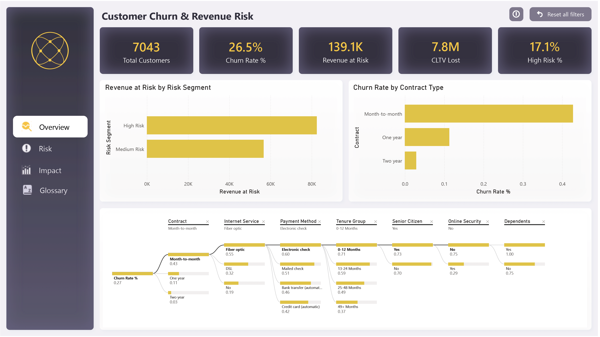
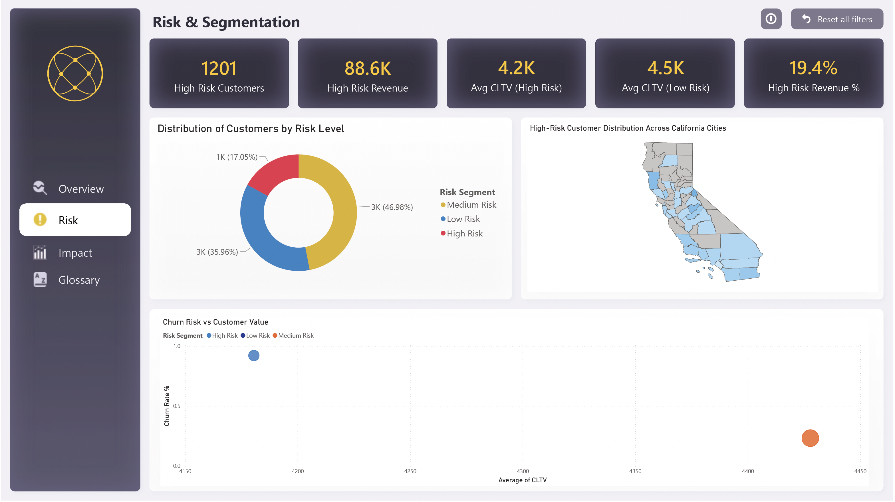
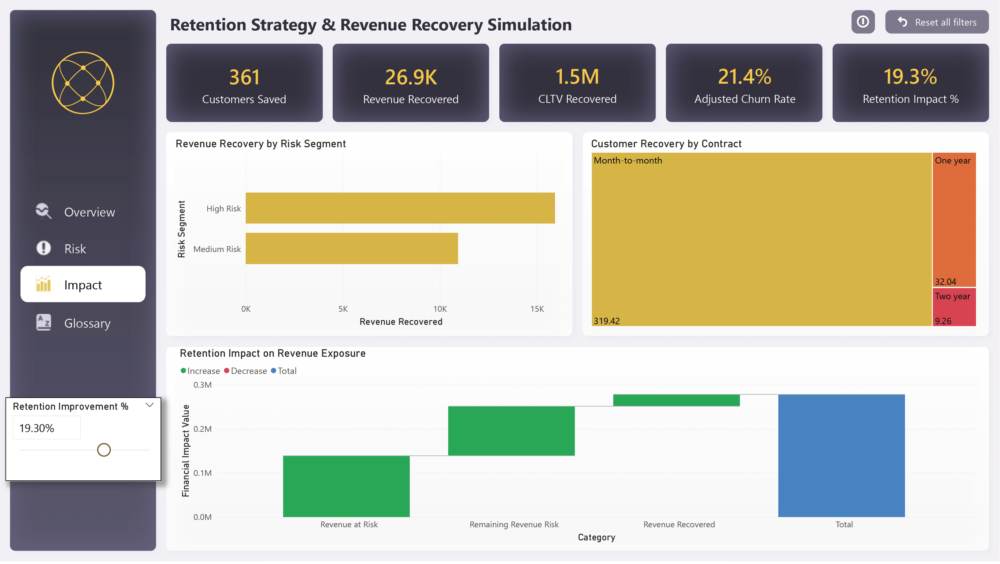
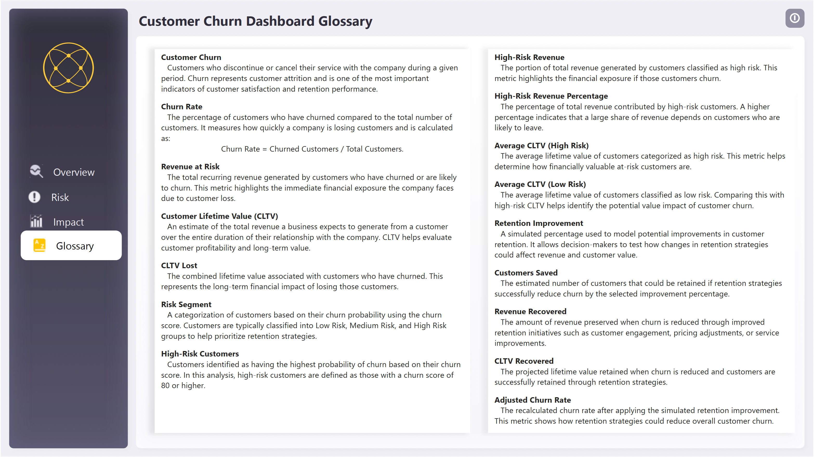

# Customer Churn Risk & Revenue Impact Dashboard

An interactive **Power BI dashboard** designed to analyze customer churn, quantify financial exposure, and simulate the potential impact of retention strategies.

Using a real telecom dataset, the dashboard goes beyond descriptive reporting to provide **decision-support analytics**. It identifies where churn risk exists, measures how much revenue is exposed, and models how improvements in retention could recover both revenue and customer lifetime value.

Dataset:  
https://www.kaggle.com/datasets/abdallahwagih/telco-customer-churn

---

# Dashboard Structure

The dashboard follows a progressive analytical workflow:

Customer Overview → Risk Segmentation → Retention Strategy Simulation

This layered approach helps stakeholders move from understanding the problem to evaluating potential solutions.

---

# Page 1 – Customer Churn & Revenue Risk Overview

The first page provides an executive overview of churn performance and its financial implications.

## Key KPIs

• **Total Customers** – Total active customer base  
• **Churn Rate** – Percentage of customers who discontinued service  
• **Revenue at Risk** – Monthly recurring revenue associated with churned customers  
• **CLTV Lost** – Lifetime value lost due to churn  
• **High Risk %** – Percentage of customers classified as high churn risk

## Revenue at Risk by Risk Segment

Customers are segmented based on churn probability:

• High Risk (Churn Score ≥ 80)  
• Medium Risk (50–79)  
• Low Risk (<50)

This visual shows whether churn-related revenue exposure is concentrated within specific risk segments.

## Churn Rate by Contract Type

This chart highlights structural churn patterns across contract types.

Insights typically observed:

• Month-to-month contracts experience the highest churn  
• Long-term contracts have significantly lower churn rates

These insights support strategic initiatives such as contract incentives or loyalty programs.

## Churn Drivers – Decomposition Tree

The decomposition tree enables interactive exploration of churn drivers.

Dimensions analyzed:

• Contract  
• Internet Service  
• Payment Method  
• Tenure Group  
• Senior Citizen  
• Online Security  
• Dependents

This allows identification of combinations of factors associated with high churn, such as short-tenure customers with month-to-month contracts.

---

# Page 2 – Risk & Customer Segmentation

This page focuses on identifying which customer groups are both high-risk and financially valuable.

## Key KPIs

• **High Risk Customers** – Number of customers with high churn probability  
• **High Risk Revenue** – Revenue generated by high-risk customers  
• **Avg CLTV (High Risk)** – Average lifetime value of high-risk customers  
• **Avg CLTV (Low Risk)** – Average lifetime value of low-risk customers  
• **High Risk Revenue %** – Share of total revenue coming from high-risk customers

## Customer Risk Distribution

A donut chart visualizes the proportion of customers within each risk segment.

This provides a quick overview of the overall risk profile of the customer base.

## Geographic Risk Distribution

High-risk customers are mapped across California cities to identify regional clusters of churn risk.

This enables targeted retention strategies based on geographic patterns.

## Churn Risk vs Customer Value

A scatter plot analyzes the relationship between:

• Customer Lifetime Value  
• Churn Risk

Bubble size represents the number of customers in each segment.

This helps identify scenarios where **high-value customers are also high-risk**, which represents the most critical retention priority.

---

# Page 3 – Retention Strategy & Revenue Recovery Simulation

The final page introduces **scenario modeling**, allowing users to simulate the financial impact of improving customer retention.

A **What-If parameter** controls the retention improvement percentage.

## Retention Improvement Parameter

Users can simulate retention improvements between:

0% – 30%

This allows decision makers to test how retention initiatives could affect business outcomes.

## Scenario KPIs

• **Customers Saved** – Estimated number of customers retained  
• **Revenue Recovered** – Monthly revenue preserved  
• **CLTV Recovered** – Lifetime value retained  
• **Adjusted Churn Rate** – Updated churn rate after retention improvements  
• **Retention Impact %** – Selected improvement scenario

## Revenue Recovery by Risk Segment

This visual identifies which risk groups generate the largest revenue recovery opportunities if retention improves.

## Customer Recovery by Contract

A treemap visualizes how retention improvements impact different contract types, highlighting segments with the greatest recovery potential.

## Revenue Impact Waterfall

The waterfall chart shows the financial impact of retention improvements:

1. Current Revenue at Risk  
2. Revenue Recovered  
3. Remaining Revenue Risk

This clearly illustrates how retention strategies reduce financial exposure.

---

# Glossary

A dedicated glossary page explains key metrics used throughout the dashboard to ensure clarity for stakeholders.

---

# Key Analytical Techniques Demonstrated

• Advanced DAX measure design  
• Customer risk segmentation using churn scores  
• Root-cause analysis using decomposition trees  
• Geographic churn analysis  
• Customer value vs churn risk analysis  
• Scenario modeling using What-If parameters  
• Revenue impact simulation  
• Executive-focused KPI storytelling

---

# Tools & Technologies

Power BI  
DAX  
Data Modeling  
Scenario Simulation  
Data Visualization  
Business Intelligence

